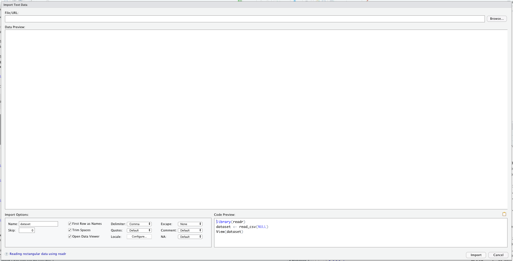
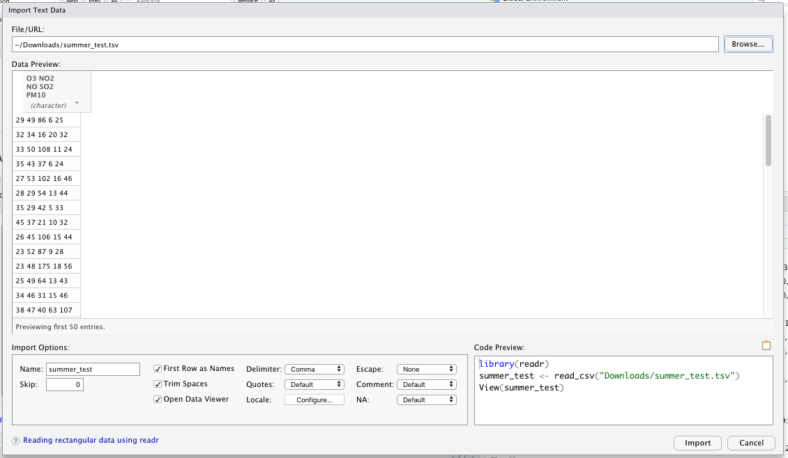
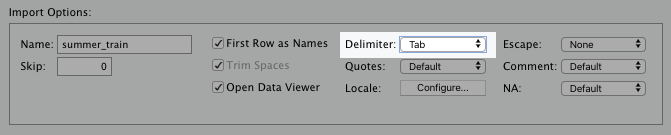
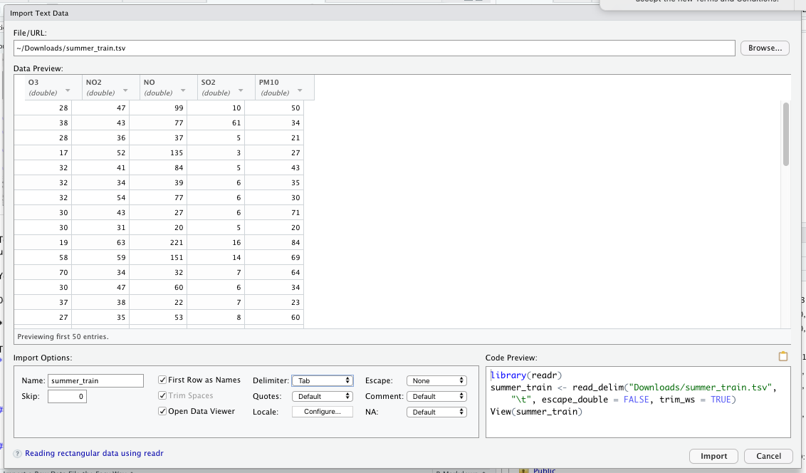

---
output:
  pdf_document: default
  html_document: default
---
# How to Import Data into R {#importdata}

There's three good ways to import data into R:

1. Import a raw data file (.csv, .xlsx, .tsv, etc.)
2. Connect to a database (SQL Server, AWS, etc.)
3. Connect to an API (Google Analytics, Census Bureau, etc.)

Students and researchers will use the first option the most. That's because your data sets are usually smaller and don't require a database. You can either write a command or use the RStudio interface to import raw data files.

The second option is what you'll use while working for a large organization. Most data is stored in a large database that you can access. If you work with a SQL database, you're in luck. You can access your database directly with RStudio! Although it does require some setup.

The third option involves connecting to an *application programming interface* (API). That's a fancy way of saying you connect to an online application. Typically, you'll download existing packages that makes this process easier.

## How to Import a Raw Data File the Easy Way

RStudio makes routine steps like importing raw data files easy. In the top right pane, you'll see an **Import Dataset** button. Click that.

```{r 6, echo=FALSE,fig.align="center",out.width="50%"}
knitr::include_graphics("1.58_Import_Raw_Data.png",dpi=75) 
```

You should get a menu that looks like this:

```{r 6.1, echo=FALSE,fig.align="center",out.width="50%"}
knitr::include_graphics("1.58.1_Dropdown.png",dpi=75) 
```

For the following example, we'll select "From Text (readr)...". This allows us to import .csv, .txt, and other text files.

Click on "From Text(readr)..." and you should see this screen:

```{r 6.2, echo=FALSE,fig.align="center",out.width="75%"}
 
```

To continue, we need to provide a file path or a URL in the top search bar. If you want to practice these steps with me, you can select "Browse..." to find a specific file on your computer.

Down below, you'll see I selected a .tsv file. As you can see, the data doesn't look quite right.

```{r 6.2.1, echo=FALSE,fig.align="center",out.width="75%"}
 
```

That's because the RStudio's default setting for raw data import assumes the data is *comma-delimited*. For the data set I'm using, I need to change the **Delimator:** option to "Tab."

```{r 6.3, echo=FALSE,fig.align="center",out.width="75%"}
 
```

The data reads correctly after making this adjustment, as you can see below:

```{r 6.4, echo=FALSE,fig.align="center",out.width="75%"}
 
```

One thing you should pay attention to before hitting **Import** is the bottom right-hand corner of the window.

```{r 6.5, echo=FALSE,fig.align="center",out.width="60%"}
knitr::include_graphics("1.63_NewCode.png",dpi=150) 
```

As you can see, RStudio writes the script that imports this data set. Selecting "import" will run this script afterwards.

Go ahead and hit import now with your own data set. You should see that data appear as a data frame in the environment tab:

```{r 6.6, echo=FALSE,fig.align="center",out.width="60%"}
knitr::include_graphics("1.64_New_Data_Frame.png",dpi=150) 
```

It's that easy! You can follow similar steps for Excel, SAS, STATA, and other data file types!

## How to Import a Raw Data File the Hard Way

In the last section, I actually provided a clue on how to import raw data the "hard" way. If you remember, RStudio's built-in **Import Dataset** option writes and executes the script to import a data set:

```{r 6.7, echo=FALSE,fig.align="center",out.width="60%"}
knitr::include_graphics("1.63_NewCode.png",dpi=150) 
```

The hard way is writing that code yourself. Personally, I think that's a waste of time. At least when you're getting started with R programming. After you get more programming experience, you may find it more efficient to write it yourself. But for now, I say just use the UI.

## Don't Forget to Save Import Scripts

It is a good idea, however, to save the scripts that RStudio generates for future use. For example, you may have a raw data set saved to a URL or a shared drive in your organization. You may also need to share your R script as a saved file with other people. In that case, you want to go ahead and save the scripts to import all relevant data.

You'll need to include that at the top of your R script, so that future collaborators can load those data sets.

Here's what that would often look like:

```{r 6.8, eval=FALSE}
  library(readr)
  summer_train <- read_delim("Downloads/summer_train.tsv", "\t", escape_double = FALSE, trim_ws = TRUE)
  summer_test <- read_delim("Downloads/summer_test.tsv", "\t", escape_double = FALSE, trim_ws = TRUE)
  customers_data <- read_csv("Downloads/Wholesale customers data.csv")
  
  library(haven)
  kidney <- read_sas("Downloads/kidney.sas7bdat", NULL)
```

In the script above, I also make sure to load both the `readr` and `haven` packages. Both are required to load the file paths below them.

## How to Connect to a Database

To connect to a database tool, work with your RStudio or database admins. Ask them for key connection information, such as:

1. Driver
2. Server URL or IP address
3. Database name
4. User name and password (if different from your typical username and password)
5. Port

Typically, these are the same inputs used when signing into your organization's database management software.

You'll also need to ensure there's an ODBC driver on your local computer or on the network you use. Again, I'd suggest asking your RStudio or database admin (or possibly even your IT admin) for help on this.

Once they have created the driver and you have the necessary credentials, you can connect to the database in the **Connections** tab in the upper-right pane:

```{r 6.11, echo=FALSE,fig.align="center",out.width="60%"}
knitr::include_graphics("1.65_Connections.png",dpi=350) 
```

These steps will produce a script that looks like this:

```{r 6.12, eval=FALSE}
  library(odbc)
  con <- dbConnect(odbc(),
                   Driver = "SQLServer",
                   Server = "sqlhostname",
                   Database = "dbase",
                   UID = "username",
                   PWD = rstudioapi::askForPassword("Database password:"),
                   Port = 1433)
```

In the same way I advised you to save your data set import scripts, I would do the same for this one. You can copy and paste it to your R script for future use.

After you complete that initial connection, you can use the  `dbReadTable()` function in the `DBI` package to import a table from the database into an R data frame.

```{r 6.13, eval=FALSE}
  dataset <- dbReadTable(con,"tablename")
```

## Connect to an API

API connections are more tool specific than the other data sources covered in this chapter. You'll need to configure both the source tool and R to accomplish this.

Fortunately, there are R packages for the most common API connections out there. I would search something like "R package for *tool-name* API connection." You'll often find what you need.

If you want to get practice with an API connection, you can read my article about connecting to the US Census Bureau's API [here](https://taylorrodgers.github.io/r-programming-examples/Ep2_Query_Census_Data.html).

## Things to Remember

* Import raw data through the **Import Dataset** button in the **Environment** tab in the upper-right pane
* Connect to databases through the **Connections** tab in the upper-right pane
* Work with your data engineering or IT team for setting up the necessary drivers and credentials for database connections
* API connections are handy for large, one time analysis
* Download specific packages to connect to an API
