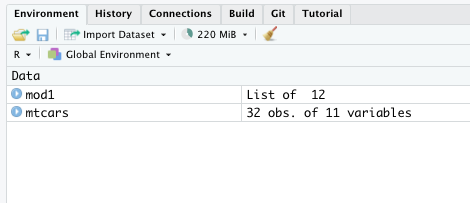
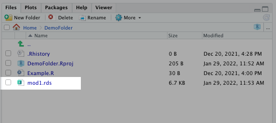

---
output:
  pdf_document: default
  html_document: default
---
# Statistical Functions in R: Common Functions and How They Work {#statfunctions}

At its core, R programming is a statistical programming language. If you are an R programmer, there's a good chance you want to make predictions or inferences with data. That's what we'll cover in this chapter!

## How Statistical Functions Work in R Programming

A great thing about statistical functions in R is that they often follow the same principles. The steps that apply to one function usually applies to others.

Typically, you'll use a model function (such as `lm()`) to create a `list` object. So long as you assign this object a name, you can apply various other functions to it and evaluate its performance.

The common functions you'll apply to this model object are:

1. `summary()`, which summarizes the model parameter estimates and overall model performance
2. `predict()`, which allows you to see what your model predicts on both existing and new data sets
3. `write_rds()`, which allows you to save the model file for future use (requires `readr` package)
4. `anova()`, which allows you to generate an *analysis of variance* on a single model or compare multiple models
5. `confint()`, which allows you to generate the confidence intervals on your model parameters

It's okay if it's not clear yet how these concepts work together. I'll demonstrate them over the next few sections. Keep in mind that even if the model type you want is not covered in this section, these functions apply to *most model objects, most of the time.*

Towards the end of this chapter, I'll provide some simple examples that walk you through the common statistical functions and models used in research.

## How to Build a Model in R (Example with Linear Regression)

Let's say we want to build a model with the `mtcars` data set. We want a model that uses **disp** to predict **mpg**. If you look at the data set below, we can see the summary statistics for those two columns.

```{r 10.1}
  data(mtcars)
  summary(mtcars[c("mpg","disp")])
```

In order to build a model, we'll use the `lm()` function. To use this function, we only need to define our formula and our data set:

```{r 10.2}
  mod1 <- lm(mpg~disp,data=mtcars)
```

The formula is defined using a `~` sign. This basically implies our regression model is "mpg=disp".

One important thing to note is the type of object this function generates. If you look at the **Environment** pane, you'll see this object saved as a `list`.

```{r 10.3, echo=FALSE,fig.align="center",out.width="75%"}
 
```

This list includes many smaller components that come in handy later. Most other modeling functions in R mimic this workflow as well.

## How to Review Common Model Performance Statistics

Building a model isn't that hard, as you can tell. Typically though, the real work lays in model evaluation. Most of these summary statistics can be found using the `summary()` function:

```{r 10.4}
  summary(mod1)
```

As you can see, this `summary()` function reveals a lot about how well this model performs. We can see the adjusted R-square, the F-Statistic, and the individual p-value for the parameter estimate.

You might ask why not just call `mod1`. Why do we have to use the `summary()` function? You can do that, but it doesn't give you nearly the same amount of detail.

```{r 10.5}
  mod1
```

The reason will be more clear in a moment. "mod1" is the actual model. While we usually want the `summary()` output after building the model, there are several other things we want to evaluate. If the output of the `lm()` function didn't produce a model, but a summary like we saw, it would be more difficult to apply other functions, such as `predict()` and `confint()`, to it.

Also, `summary()` is a universal function within R. It can also be applied to data frames and vectors. Not just the `lm()` output.

### It's Useful to Save the Summary Output

Sometimes, you may want to evaluate one model against another. Whenever that happens, it's useful to create another object for the summary output of the model. This will allow you to select individual pieces of the output you saw above.

For example, I can create a new list for model 1's summary. I can then use the `$` notation to call individual performance indicators for that model, such as `adj.r.squared` or the `fstatistic`.

```{r 10.6, results=FALSE}
  mod1_summary <- summary(mod1)
  mod1_summary$adj.r.squared
  mod1_summary$fstatistic
```

You can determine what values are available in a model summary using the `names()` function:

```{r 10.6.1}
  names(mod1_summary)
```

## How to Make Predictions with a Model

Many researchers are more interested in the "inferential" side of statistics. In plain English, you're hoping to prove or disprove a relationship between one variable and another. Others time, you may want to use your model to predict future events or outcomes. This is more common for data scientists like me.

You can use the `predict()` function to make predictions on new data. Actually, you can use this function without new data simply by plugging the model object name in. This will show you what the model predicts using the original data set (which is often a useful model performance indicator on its own).

```{r 10.7}
  predict(mod1)
```

Let's say we have new values for **disp**. We want to see what our model predicts for **mpg** using these new records. All we have to do is specify the model object name and the data set object name in the `predict()` function:

```{r 10.8}
  disp_new <- data.frame(disp=c(rnorm(15,240,30))) #this simply generates random numbers
  predict(mod1,disp_new)
```

As you can imagine, this `predict()` function comes in handy. And it's a common feature for most model objects produced in other R packages. I've used this for neural nets and other more advanced predictive algorithms. It comes up again and again.

## How to Save Your Model to Use Later

It's quite common to share models between colleagues. Maybe another researcher wants to re-produce what you created or another data scientist will integrate your model into a Shiny app. 

That's where `.rds` files come in handy.

`.rds` files allow you to save objects on your desktop or user directory for later use.

You'll need to load the `readr` package to create these file types. After that, you'll use the `write_rds()` function to create an `.rds` file and `read_rds()` to load it. (You may need to install this package using `install.packages()`.)

```{r 10.9}
  library(readr)
  write_rds(mod1,"mod1.rds")
```

After running the previous script, you'll see an `.rds` file appear in your current working directory (usually your project directory or your default user directory). You can specify the file path in that script above between the two quotations marks.

```{r 10.10, echo=FALSE,fig.align="center",out.width="75%"}
 
```

If you want to re-use this model, you can simply reload the `.rds` file using the `read_rds()` function. Be sure to assign this object a name to make it work.

```{r 10.11}
  model_reload <- read_rds("mod1.rds")
```

And here's the cool part about this `.rds` file - *you don't need to reload the original data set to make this new model work!* If you feed it new data, it'll make new predictions. This comes in handy whenever you build Shiny apps or want to "productionalize" the model.

```{r 10.12}
  disp_new <- data.frame(disp=c(rnorm(15,240,30)))
  predict(model_reload,disp_new)
```

## How to Add Multiple Parameters to a Model

You can add additional parameters to your model by adding to the formula in the `lm()` function. Let's say we want to add the **drat** and **wt** variables to your regression model. All you have to do specify both variables with a `+` sign between them.

```{r 10.13}
  mod2 <- lm(mpg~disp+drat+wt,mtcars)
  summary(mod2)
```

As you can see above, those variables aren't necessarily the best addition or combination. But since it's an example, we won't worry too much about it here.

## How to Add a Categorical Variable to a Model

So far, I've only shown you how to add **continuous** variables. What if we want to add a **categorical** variable?

If a column in a data frame has character values (i.e., text), a model function will automatically treat it as a categorical variable. If it contains numeric values, we'll need to make it a **factor**. (Review our chapter on object-types for a quick refresher on this topic.)

```{r 10.14}
  mod3 <- lm(mpg~disp+factor(cyl),mtcars)
  summary(mod3)
```

## How to Add Transformed Variables to a Model

Quite often, you may need to transform your variables to make them work in a model. Let's say you want to build a log-log model. That has different meanings depending on your field of study, but in econometrics, a log-log model transforms both the inputs and the outputs using the natural logarithm. (This is how they often calculate price elasticity.)

You could simply do these transformations in the formula argument in the `lm()` function. If you look below, I simply wrap both the independent and dependent variable with the `log()` function:

```{r 10.15}
  mod4 <- lm(log(mpg)~log(disp),mtcars)
  summary(mod4)
```

This works okay for smaller models. If you want to transform several variables, it's usually easier to create new ones in the data set prior to building the model:

```{r 10.16}
  cars_log <- mtcars
  cars_log$mpg_log <- log(cars_log$mpg)
  cars_log$disp_log <- log(cars_log$disp)
  cars_log$qsec_log <- log(cars_log$qsec)
  
  summary(cars_log[c(1,3,7,12,13,14)])
```

We can then use those new columns in the model function:

```{r 10.17}
  mod5 <- lm(mpg_log~disp_log+qsec_log,data=cars_log)
  summary(mod5)
```

## How to Add Variable Interactions to a Model

It's not uncommon to include interactions in your model, especially if you have two variables that seem to be correlated. To create these interactions, you simply use the `*` between them in the model formula.

```{r 10.18}
  mod6 <- lm(mpg~drat+wt+drat*wt,data=mtcars)
  summary(mod6)
```

You actually don't even need to specify the variables individually. For example, rather than `mpg~drat+wt+drat*wt`, you can simply use `mpg~drat*wt` and the function will treat them individually and as interactions.

```{r 10.19}
  mod6 <- lm(mpg~drat*wt,mtcars)
  summary(mod6)
```

## How to Calculate Model Confidence Intervals

Even though the p-value tells you whether the variable is statistically significant, it's often a best practice to include confidence intervals in your analysis. R makes this very easy! Simply wrap the `confint()` function around your model object.

```{r 10.20}
  confint(mod2)
```

If you want to have a different critical value, you can change it using the **level** argument. 

```{r 10.21}
  confint(mod2,level=.9)
```

See `?confint` to read more about the function.

## How to Calculate Analysis of Variance Between Models

You'll often need to compare models with more parameter estimates to simpler ones. To do so, you simply create your two models and then use the `anova()` function:

```{r 10.22}
  anova(mod1,mod2)
```

## Other Common Model Types - Logistic Regression

Chances are, you want to do more than a linear regression. Most statistics or ML textbooks will cover the programming steps involved for a particular model type. Those models usually follow the same procedures I highlighted earlier.

That said though, I can provide some general functions used in the more common statistical models, such as logistic regression and anova models.

To run a logistic model, you can use the `glm()` function. In the script below, I build use **mpg** and **wt** to predict whether **vs** is a 1 or a 0. I use the `family` argument to make it a logistic model.

```{r 10.23}
  mod7 <- glm(vs~mpg+wt,data=mtcars,family=binomial(link="logit"))
  summary(mod7)
```

The `glm()` function has a larger range of model types than the `lm()` function. I suggest reviewing it with `?glm` in the console whenever you want to build a particular type of linear model not yet discussed here. The `family` argument may provide the right model type you need.

Just like we did for the linear regression model, we can use the `confint()` functions on this model object to generate a confidence interval. You can see this below:

```{r 10.24}
  confint(mod7)
```

You can also use the `predict()` function on this model.

## Other Common Model Types - Anova Models

To build an ANOVA model, you'll use the `aov()` function. This function follows a similar process to the `lm()` function and actually generates a regression model using the formula you enter.

As you'll learn in your stats class, many ANOVA models focus on categorical variables to determine whether there's a difference in the mean outcome. A common model for this scenario is a *fixed-effects model*. 

Let's convert a few of our **cars** data into factors, so that we can build a fixed-effects model.

```{r 10.25}
  mtcars_factor <- mtcars
  mtcars_factor$gear <- factor(mtcars_factor$gear)
  mtcars_factor$vs <- factor(mtcars_factor$vs)
```

Remember, most model functions in R will treat numeric inputs as a continuous variable. Since we want to treat these variables (which range includes the labels 0, 1, 3, and 4), we need to ensure that the function we run treats them as categorical. That's why we factor them.

Now we can build the fixed-effects model using the `aov()` function:

```{r 10.26}
  mod8 <- aov(mpg~vs+gear,data=mtcars_factor)
  summary(mod8)
```

The `summary()` function also gives you the ANOVA table for this model and allows you to determine which group explains the most variation.

Sometimes you still want a model that shows you the actual impact a variable has on the expected output. We can do this by first running the `lm()` function with our formula.

```{r 10.27}
  mod9 <- lm(mpg~vs+gear,data=mtcars_factor)
  summary(mod9)
```

And you can reference the model object again in the same `aov()` function from earlier and get your ANOVA table.

```{r 10.28}
  summary(mod8)
  summary(aov(mod9))
```

## Things to Remember

* Building and evaluating models often follows the same steps, regardless of the functions you use
* The model function (`lm()`, `glm()`, `aov()`, etc.) produces a list
* You can assign that list a name and reference it again
* You can get most model performance metrics with the `summary()` function
* You can use that model object to make predictions on both new and existing data with the `predict()` function
* You can use that model object to generate confidence intervals with the `confint()`function
* You evaluate two models against one another with the `anova()` function
* You can export your model (without exporting the data) using the `write_rds()` function

## Exercises

1. Using the data set **iris** (`data(iris)`), build a linear regression model that uses **Sepal.Length** and **Sepal.Width** to predict **Petal.Length**. Assign the model the name "PracticeModel".
2. Determine whether the two parameters are statistically significant. (i.e., their p-values are less than 0.05.)
3. Predict the value of **Petal.Length** with a **Sepal.Length** of 5 and a **Sepal.Width** of 3.25. (Hint: create a single row data frame with those two values assigned to their respective column names.)
4. Determine the model's confidence intervals.

